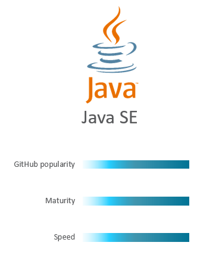
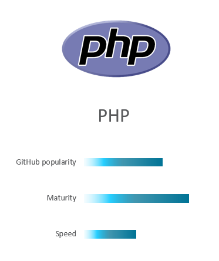
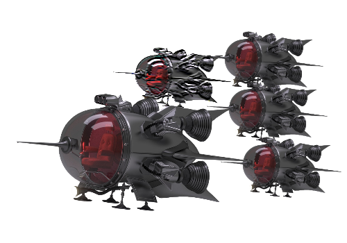
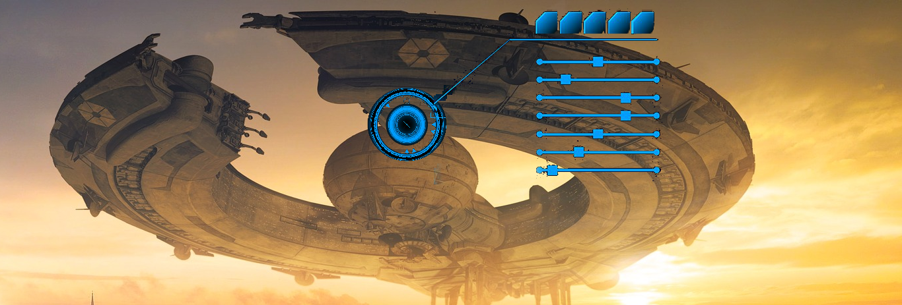

# Becoming the Dev Star #

## Introduction ##


In this adventure you will work together in squads to complete the mission – becoming the Dev Star.

Choose your platform space fighter of choice (Node.js, Java or PHP) and develop and deploy cloud native microservices that will help defeat the Alien War Ship.

You will learn how to build, manage and deploy cloud native microservices.

+ You will learn how to manage the source control, continuous integration and continuous deployment of your microservices in a DevOps manner.
+ You will explore and perform actions related to scaling and operating your microservices.
+ You will use your creativity and team play to develop features to your microservices that will help your team win!

### Prerequisites ###

Laptop with a browser. 
GitHub Account.

Familiarity with any of the following coding languages is an advantage: Java, PHP or Node.js.

## Introduction ##

The Alien War Ship needs to be defeated. You and your space microservice fighters are the last hope for planet Earth!

The adventure is intense and a set of missions must be accomplished in order to achieve the desired victory!


Fortunately, one of our companions is a spy, Tom Kurious, and have managed to sneak into the Alien War Ship. During our missions, he will report valueable information that might help us bring down the Alien War Ship!

## How to play ##

#### Objective ####

By developing space fighters (microservices) in either Java, Node.js or PHP, you will complete missions in order to defeat the Alien War Ship. The missions will be explained in the instructions, but you can't complete some of the missions without valuable information from the spy.

#### Squads ####

You work together in squads with the common goal to defeat the Alien War Ship. A squad can consist of any number of members and skill level. When someone in the squad completes a mission on behalf of the squad, the mission will be deemed completed for the entire squad. This means that if another squad member completes the same mission, it will not give extra points.

## Scoring ##

The points are obtained as your squad completes the missions. The sooner your team completes a mission, the more points you will get. But don't worry, also the last squad to complete a mission will give valuable damage to the Alien War Ship.

## Squad ##

You should now have been assigned a squad and should have the following. If you have not been assigned please speak to Martin.

 - Squad Name
 - Username
 - Password
 - Identity Domain
 - Rest API Address
 - Address to log into the cloud portal

 It is now time to select your weapon of choice.

+ Weapon selection strategy is completely up to your preference. Every squad members can have the same weapon, different weapons or chose to have no weapon at all.
+ Each git repository includes the basic code that is needed in order to run and deploy your microservice to the battle action!

|  |  |  |


| Weapon        | Git Repo to Fork  |
| ------------- | -----|
| Node.js       | ``` https://github.com/thebeebs/xwingnodeclient ``` |
| Java SE     |   ``` git clone https://github.com/thebeebs/xwingjavaclient1 ``` |

| PHP |  ``` git clone https://github.com/thebeebs/xwingphpclient ``` |

2. Go to the preferred Weapon's Git Repo and fork into your own repository. Either clone this repo locally or you can simply work on git hub and edit the files if you do not not have local development tools that you would prefer to use.

3. You should now successfully have cloned the code to your laptop.

## Mission: Deploy your first fighter! ##

Before you start your first mission, make sure you are ready as per below

- [x] You understand the goal of the workshop
- [x] You have grouped together with your squad
- [x] You have received your squad's, Name,  Identitiy Domain, the username and the password
- [x] You have selected which weapon you, as a member of your squad, will be using
- [x] You are able to clone the source code of your weapon to your development environment.

### Mission Description ###

In order to take up the battle against the Alien War Ship, your squad would need to deploy at least one space fighter (microservice) to the cloud.

### Mission Awards ###

- Maximum number of points for this mission: **100**
- Lesser points will be given to subsequent squads.

### Mission Instructions ###

To deploy your fighter, you will use Continuous Integration and Deployment.
+ In short, the **Continuous Integration and Deployment** strategy means that you push the code from your development environment to the Git repository. Werker will then automatically build, package and deploy your application to Application Container Cloud. 

You will not to have to worry about compilation, package and deployment.

Since your code is already cloned, all you need to do is to make a change on it, commit the change to the local repository and push it to the remote original repository on Github. 

To Get this deployment working we will need to create an Account with Wercker.

# TODO: Instructions of how to set up Wercker

1. Let's first make a change to make sure that when you push the code, a difference in the repository is identified and the build job is properly triggered.
So, depending on the language you chose, have your code opened and make the suggested change:

 **Node.JS**: Open the file *xwingnodeclient/app.js* and on the first line insert a comment line with some text.
                        
                        eg: // My microservice!

 **Java**: Open the file *src/main/java/com/example/rest/App.java* and on the first line insert a comment line.

                        eg: // My microservice!

 **PHP**: Open the file *index.php* and edit the line on row 2 (below "<php") and insert a comment line.

                        eg: // My microservice!

2. Save the file using Ctrl + s.

3. Check the file into GitHub.

       git add .

       git commit -m "My first commit"

       git push

4. Monitor the Dev Star dashboard to await your fighter being deployed! If you can't see the Dashboard well on the projector/screen, just open the following url TODO: ADD URL. Your space fighter should appear in the dashboard and complete it's first strike to the Alien War Ship!

## Mission: Scale your first fighter! ##

### Mission Description ###

Your squad has now deployed one or several individual microservices (fighters). Our next mission will be add to another fighter to the squad by scaling up the number of instances for one of them.


### Mission Awards ###

- Maximum number of points for this mission: **100**
- Lesser points will be given to subsequent squads.

### Mission Instructions ###

1. Sign in to Application Container Cloud using the URL and credentials you were given by Martin.

2. Click your deployed application:

3. Click your deployed application. If your microservice is deployed, you can view the logs. [Click here](../logs.md) for instructions on how to view the logs. **Before you continue to the next step, make sure that you are able to retrieve and read the logs from your running application!**

4. You should now understand how to view the logs of your deployed application, if not, check the previous step before you continue. Increment the number of instances to 2. Please note that adding more than 1 instances do not give you any more points or advantages.

## Mission: Take down the shield! ##

### Mission Description ###

Your squad is ready and it should now have one or more microservices with at least one of them having 2 instances.

The Alien War Ship is protected by it's powerful shield. As long as we can't break through the shield, we will have a hard time hitting the core reactors of the Alien War Ship.
To start firing at the shield, we first need to have the Alien War Ship exposing it's coordinates. Keep an eye out on what our spy is saying. It should be in the SPY section of the Dashboard.

### Mission Awards ###

- Maximum number of points for this mission: **300**
- Lesser points will be given to subsequent squads.

### Mission Instructions ###

1. Make sure that our spy has reported some more information about the coordinates of the shield. If not, you have to wait a bit!

2. We now need to fire at the coordinates of the shield! You will do this by changing the code in your microservice and deploy the new version. 

- For Java, the file is located at src/main/java/com/example/rest/App.java (in the folder where you locally cloned the code)
- For Node.js, the file is located at xwingnodeclient/app.js (in the folder where you locally cloned the code)
- For PHP, the file is located at index.php (in the folder where you locally cloned the code)

The base URL of the shield is ```TODO: http://129.157.179.180:3000/shield/x-coordinate_goes_here/y-coordinate_goes_here/Your_squad_name_goes_here(e.g yellow)/Your_microservice_name_goes_here(e.g YellowJava2Fighter)```. **The shield will get hit by HTTP GET Request bullets!**

**Hint: Make sure that your code/function is actually being called **

You need to look through your App.java, app.js or index.php file depending on your language and find out what changes you will need to make to invoke the shield's URL!

3. Deploy a new version of your microservice by pushing the edited code to the Git repository in the same way as for your first deployment. 

4. When your updated microservice is live, it will hopefully hit the Alien War Ship's shield!

5. If you feel that your microservice is not behaving correctly or might not have been deployed correctly, have a look at the logs as described [here](../logs.md).

## Mission: Shoot down the Mini Fighters ##

### Mission Description ###


The Alien War Ship has sent out 10 Mini Fighters to attack your fighters! You need to take them down as soon as possible. The mission is completed when a squad has shot down all the Mini Fighters.

### Mission Awards ###

- Maximum number of points for this mission: **500**
- Lesser points will be given to subsequent squads.

### Mission Instructions ###

1. You should now have received information from the spy that will give you the y-coordinates of the Mini Fighters. The example below would shoot down ***one*** of the Mini Fighters. ***The x-coordinate is locked at coordinate 45***.

```TODO: http://129.157.179.180:3000/fighters/45/y-coordinate_goes_here/Your_squad_name_goes_here(e.g yellow)/Your_microservice_name_goes_here(e.g YellowJava2Fighter)```. **The Mini Fighters will get hit by HTTP GET Request bullets!**

**Hint: Notice the changed endpoint 'fighters'**

3. Deploy a new version of your microservice by pushing the edited code to the Git repository in the same way as for your first deployment.

3. When your updated microservice is live, it will hopefully hit the Mini Fighters sent out by the Alien War Ship!

4. If you feel that your microservice is not behaving correctly or might not have been deployed correctly, have a look at the logs as described [here](../logs.md).

## Mission: Destroy the Reactor Core! ##

### Mission Description ###


The spy should now have exposed the secrets of the database where the Alien War Ship stores the coordinates to it's Reactor Core! When our spy returns with the information, find out the coordinates and attack it with your fighter!

### Mission Awards ###

- Maximum number of points for this mission: **500**
- Lesser points will be given to subsequent squads.

### Mission Instructions ###
1. You should now have received information from the spy about the credentials to the Alien War Ship's MySQL database where the coordinates for the Core Reactor is kept. Develop a MySQL query that queries the **SecretTable** to retrieve information about the Reactor Core coordinates! The Host IP address of the database is TODO: **129.157.179.180**

2. When you have the coordinates, hit the Reactor Core at the following URL:
```TODO: http://129.157.179.180:3000/reactorCore/x-coordinate_goes_here/y-coordinate_goes_here/Your_squad_name_goes_here(e.g yellow)/Your_microservice_name_goes_here(e.g YellowJava2Fighter)```.
**The Reactor Core will get hit by HTTP GET Request bullets!**

**Hint: Notice the changed endpoint 'reactorCore'**

3. Deploy a new version of your microservice by pushing the edited code to the Git repository in the same way as for your first deployment.

4. When your updated microservice is live, it will hopefully hit the Alien War Ship's Reactor Core!

5. If you feel that your microservice is not behaving correctly or might not have been deployed correctly, have a look at the logs as described [here](../logs.md). 

### Next: You are finished ###

Congratulations! You are finished! If the Alien War Ship is still alive, help out your colleagues!


