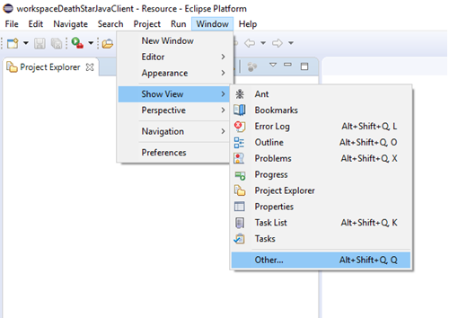
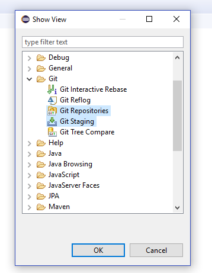
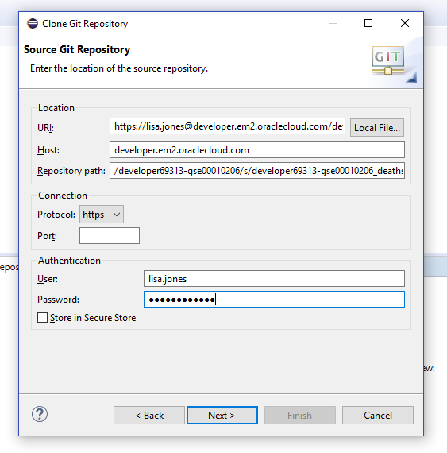
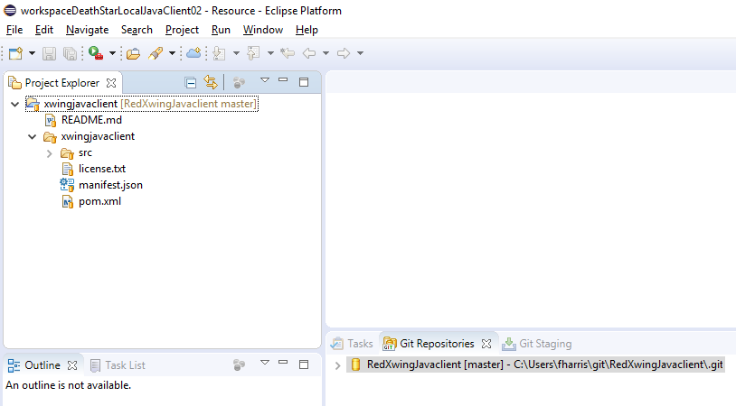
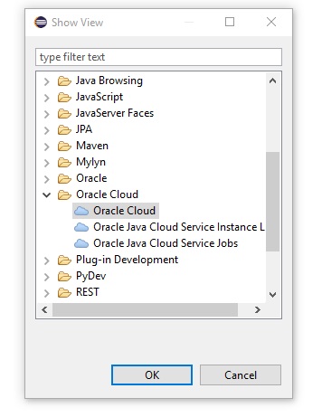
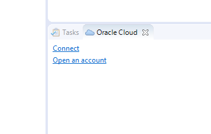
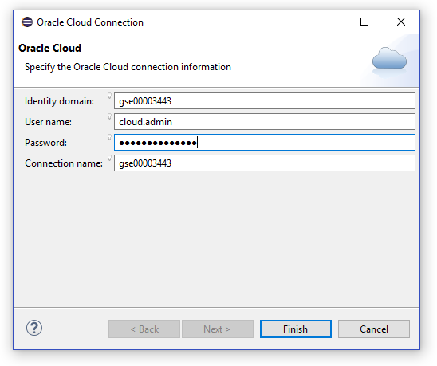
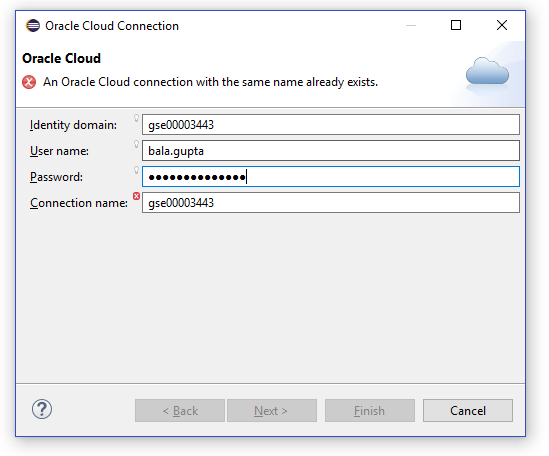
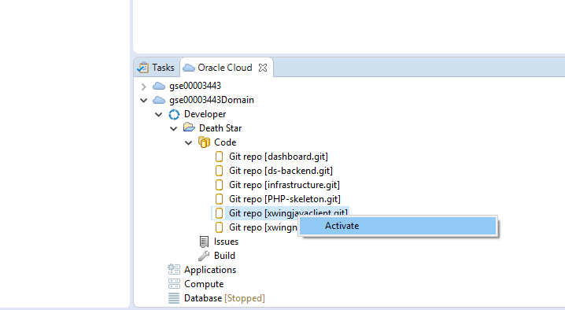

## Clone code using Eclipse ##

Open your Eclipse.
Go to Window --> Show View --> Other...

Choose
--> Git... and finally select the views **Git Repositories** and **Git Staging**

Now, in the Git Repositories view, click: **Clone a Git Repository**.

In the following window select Clone URL and then paste the URL from the repository you're trying to clone. Don't forget the credentials for your user (they can be found in the Excel sheet handed out to you)

After selecting the master repository, click Next and Finish. You now have the repository cloned locally!
In Eclipse's Project Explorer, right-click the repository --> Import Projects...

Click Finish and you should now have your project created in Eclipse Project Explorer view.

### Next: First Mission ###

The code is cloned! You are ready to face your first mission! [click here](../missions/deploy.md) to start!

## Using Git with Eclipse Oracle Enterprise Package (OEPE) ##

This alternative is optional and if you followed the alternative in the previous point, you can ignore this and move on!

### Next: First Mission ###

The code is cloned! You are ready to face your first mission! [click here](../missions/deploy.md) to start!
