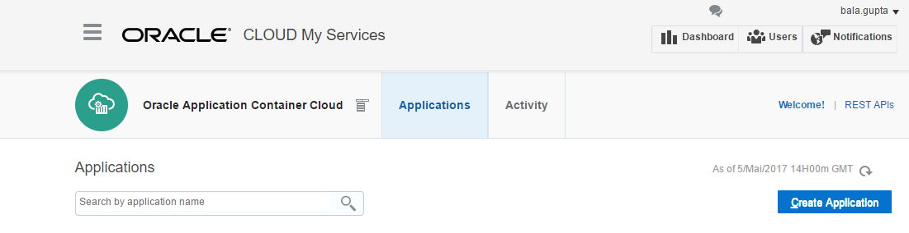
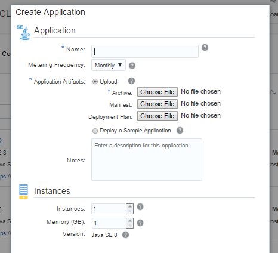

# Deploy Manually #

If you are here is because you are a space fighter and you don't need help of your space robot (Developer Cloud Service) with the packaging and deployment.
So remember, depending on the language you choose, there are a couple of different requirements in order to be able to compile and package your applications locally. In the first part of this page we give you some hints and basic recommendations regarding compilation, testing locally and packaging. In the bottom of the page you'll find a tutorial with basic instructions on how to then deploy your application to Oracle Application Container Cloud.

## Build, package and test ##

  **Java: Maven and JDK installed**

  Inside the folder where your code is cloned:

  To build and compile:

         mvn clean package

  Then to run or test locally:

         java -jar target/XwingApp-1.0.jar

  If successful, your application should be running at *http://localhost:8080*

 **To zip the final deployable artefact, you should zip the manifest.json file together with the target/XwingApp-1.0.jar file. Alternatively, you should find a zip file in the target folder that you can deploy directly**

   -----------------------------------------------------------------------------------------------------------------

  **Node.js: NPM installed**

  Inside the folder where your code is cloned, go to **xwingnodeclient**:

  To run or test locally:

         node ./bin/www

  If successful, your application should be running at *http://localhost:3001*

  **To zip the final deployable artefact, you should zip everything in the xwingnodeclient folder.**

  -----------------------------------------------------------------------------------------------------------------

  **PHP: Apache web server and PHP installed**

  This tutorial does not cover the details of running a PHP application locally. If you have selected this weapon, we trust you know how to run a PHP file on a local server such as Apache. However, once you are happy, zip your PHP files together with the manifest.json into a zip file.

  -----------------------------------------------------------------------------------------------------------------
<!--
  **Ruby: Ruby and bundler gem installed**

  Inside the folder where your code is cloned go to **xwingrubyclient**

  To install the required gems run:

         bundle install

  Then to run or test locally:

         bundle exec ruby app.rb

  If successful, your application should be running at *http://localhost:4567*

  **To zip the final deployable artefact, you should zip your Ruby files, Gemfile, manifest.json and a script to run "bundle install" before running "bundle exec".  Do not include bundle or .bundle directories in the zip file.**

  -----------------------------------------------------------------------------------------------------------------
-->
Note: At the end of the compilation process, regardless of language,  you should have a **zip file** containing the application (or static content) and the respective **manifest.json** file to proceed to deployment as explained below.

## Using Application Container Cloud console to deploy ##

Here are the steps you'll need to follow:

1) Open the Oracle Application Container Cloud Service Applications page by accessing the URL provided in the Excel sheet that has been handed out to you.

2) Click Create Application.

3) Select an application type: Java SE, Node, or PHP.

4) Application Artifacts: Press Choose File for Archive and navigate to your zip file.
For name, enter something that is easily identified, e.g BlueNode2Fighter

Press Create.

## Upload new version ##

In the upcoming missions, whenever you want to upload a new version of your application, simply click on your application and then select **Deployments** -> **Upload New** -> **Application Archive** -> **Choose File** -> **OK**

### Next: Back to Mission ###

[Click here](../missions/deploy.md) to go back to the mission instructions!
