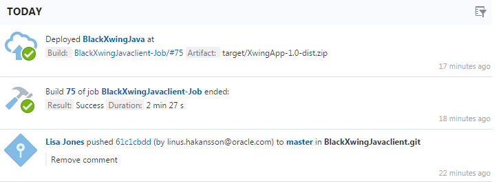
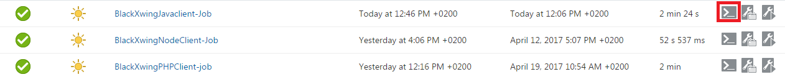
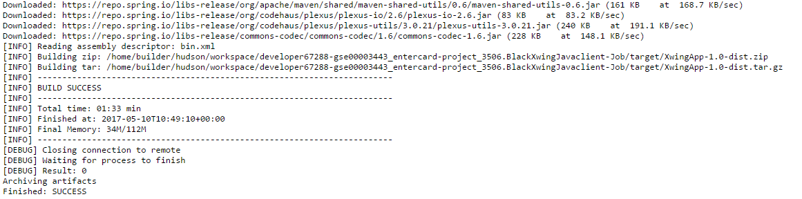
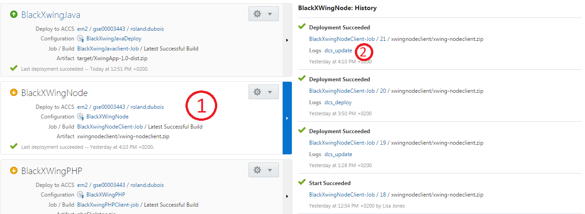
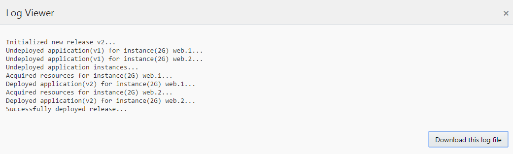

## Developer Cloud Instructions ##

Each squad has a Developer Cloud environment set up. This environment is optional but to use. For each of the GIT repositories an automatic build and deployment is being provided. **You will find the URL and the credentials in the Excel-sheet you were handed out.**

When logging in to Developer Cloud you will get to the main project page. This is where you can see the latest actions that have been performed.

### Build Jobs ###

It might be necessary to view the build jobs console of the build that have been set up for building the microservice. To do this go into the build tab in Developer Cloud. In the left side bar click on Build. Look for the microservice that you're working on and click the console output icon (red highlighted in the picure below):

In here you will be able to see the log of the latest build job. This log can give you pointers if something went wrong:

### Deployment ###

To see the deployment status go to the Deploy tab in Developer Cloud. In the left side bar click on Deploy. Here you will see all the deployment configurations. Click on any of the deployments to see the deployment history.

When you click on the log file you get into the following screen:

