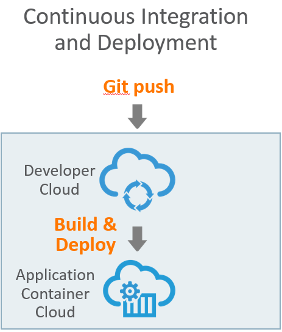
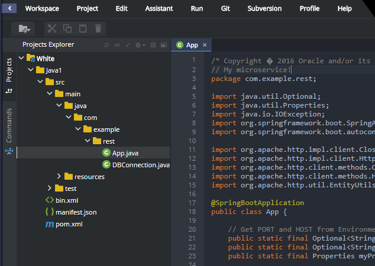
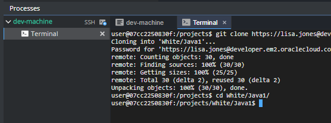

## Mission: Deploy your first fighter! ##

Before you start your first mission, make sure you are ready as per below

- [x] You understand the goal of the workshop
- [x] You have grouped together with your squad
- [x] You have received your squad's Identitiy Domain, the username and the password
- [x] You have selected which weapon you, as a member of your squad, will be using
- [x] You are able to clone the source code of your weapon to your development environment.

### Mission Description ###

In order to take up the battle against the Alien War Ship, your squad would need to deploy at least one space fighter (microservice) to the cloud.

### Mission Awards ###

- Maximum number of points for this mission: **100**
- Lesser points will be given to subsequent squads.

### Mission Instructions ###

To deploy your fighter, you will use Continuous Integration and Deployment.
+ In short, the **Continuous Integration and Deployment** strategy means that you push the code from your development environment to the Git repository. Oracle Developer Cloud will then automatically build, package and deploy your application to Application Container Cloud. 

The flow is highlighted below.

 

You will not to have to worry about compilation, package and deployment.
Since your code is already cloned, all you need to do is to make a change on it, commit the change to the local repository and push it to the remote original repository in Developer Cloud Service. This will immediately trigger Developer Cloud Service continous integration pipeline, which means that your code will compile, package a zip file and deploy it automatically to Oracle Application Container Cloud.

1. Let's first make a change to make sure that when you push the code, a difference in the repository is identified and the build job is properly triggered.
So, depending on the language you chose, have your code opened and make the suggested change:

 **Node.JS**: Open the file *xwingnodeclient/app.js* and on the first line insert a comment line with some text.
                        
                        eg: // My microservice!

 **Java**: Open the file *src/main/java/com/example/rest/App.java* and on the first line insert a comment line.

                        eg: // My microservice!

 
 
 **PHP**: Open the file *index.php* and edit the line on row 2 (below "<php") and insert a comment line.

                        eg: // My microservice!
<!--
+ Ruby: Ruby and bundler gem installed

 **Ruby**: Open the file *xwingrubyclient/app.rb* and on the first line insert a comment line with your squad name.

                        eg: # Yellow
-->

2. Save the file using Ctrl + s.

3. Before we commit the file you need to change to the directory of your repoistory. In the Terminal window, use the cd command to change to your directory as below. Use your squad color and your selected weapon name (for example cd White/Java1).

4. Now we will keep using the terminal window to add your saved files to the staging area, commit the changes with a message and finally push the committed changes to the remote Developer Cloud repository. Perform below commands as instructed by the text and picture.

       git add .

       git commit -m "My first commit"

       git push

 

After pushing the code to the remote repository in Developer Cloud Service, why don't have a look on the result:
[click here](../devcs.md) to go to the instructions for Developer Cloud Service.

5. Monitor the Dev Star dashboard to await your fighter being deployed! If you can't see the Dashboard well on the projector/screen, just open the URL from the Excel document. Your space fighter should appear in the dashboard and complete it's first strike to the Alien War Ship!

### Next: Second Mission ###

If your microservice is already up and running [click here](scale.md) to continue on with the next mission!
