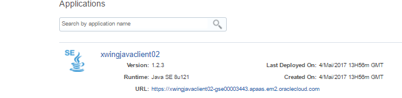
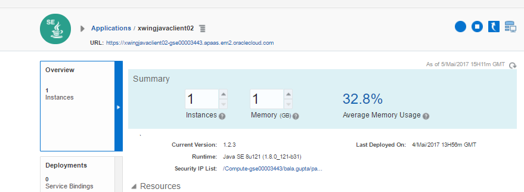

## Mission: Scale your first fighter! ##

### Mission Description ###

Your squad has now deployed one or several individual microservices (fighters). Our next mission will be add to another fighter to the squad by scaling up the number of instances for one of them.

### Mission Awards ###

- Maximum number of points for this mission: **100**
- Lesser points will be given to subsequent squads.

### Mission Instructions ###

1. Sign in to Application Container Cloud using the URL and credentials from [https://thebeebs.co.uk/devstar](https://thebeebs.co.uk/devstar).

2. Click your deployed application:

3. Click your deployed application. If your microservice is deployed, you can view the logs. [Click here](../logs.md) for instructions on how to view the logs. **Before you continue to the next step, make sure that you are able to retrieve and read the logs from your running application!**

4. You should now understand how to view the logs of your deployed application, if not, check the previous step before you continue. Increment the number of instances to 2. Please note that adding more than 1 instances do not give you any more points or advantages.

### Next: Third Mission ###

Your squad is now confident to start fighting the Alien War Ship. Be ready, now the real fun starts! [Click here](shield.md) to continue on to the next mission!
