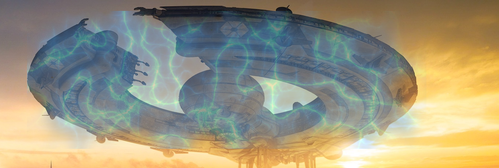

## Mission: Take down the shield! ##

### Mission Description ###

Your squad is ready and it should now have one or more microservices with at least one of them having 2 instances.

The Alien War Ship is protected by it's powerful shield. As long as we can't break through the shield, we will have a hard time hitting the core reactors of the Alien War Ship.
To start firing at the shield, we first need to have the Alien War Ship exposing it's coordinates. Keep an eye out on what our spy is saying. It should be in the SPY section of the Dashboard.

### Mission Awards ###

- Maximum number of points for this mission: **300**
- Lesser points will be given to subsequent squads.

<!--
+ Note to instructor: Edit this page with the correct IP address and port in the URL.
-->

### Mission Instructions ###

1. Make sure that our spy has reported some more information about the coordinates of the shield. If not, you have to wait a bit!

2. We now need to fire at the coordinates of the shield! You will do this by changing the code in your microservice and deploy the new version. 

- For Java, the file is located at src/main/java/com/example/rest/App.java (in the folder where you locally cloned the code)
- For Node.js, the file is located at xwingnodeclient/app.js (in the folder where you locally cloned the code)
- For PHP, the file is located at index.php (in the folder where you locally cloned the code)

The base URL of the shield is ```http://129.157.179.180:3000/shield/x-coordinate_goes_here/y-coordinate_goes_here/Your_squad_name_goes_here(e.g yellow)/Your_microservice_name_goes_here(e.g YellowJava2Fighter)```. **The shield will get hit by HTTP GET Request bullets!**

**Hint: Make sure that your code/function is actually being called **

You need to look through your App.java, app.js or index.php file depending on your language and find out what changes you will need to make to invoke the shield's URL!

3. Deploy a new version of your microservice by pushing the edited code to the Git repository in the same way as for your first deployment. If you need a reminder on how to do that, check the instructions for the [first mission](deploy.md)

4. When your updated microservice is live, it will hopefully hit the Alien War Ship's shield!

5. If you feel that your microservice is not behaving correctly or might not have been deployed correctly, have a look at the logs as described [here](../logs.md). If you are using the Continuous Integration and Deployment strategy, explore the status of your build in Developer Cloud as described [here](../devcs.md)

### Next: Fourth Mission ###

The Alien War Ship is getting weaker! Let's start attacking it more. [Click here](iterate.md) to continue!
