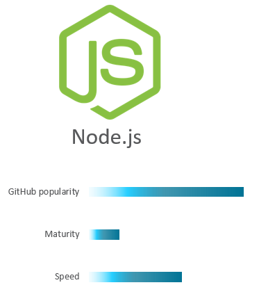
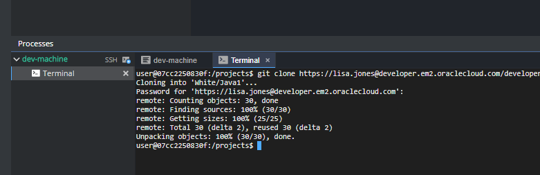

## Welcome to the Yellow Squad. Let's get ready! ##

1. Now it is time to access your development environment. Right click on below 'Developer Workspace' button and open it in a new tab, to access your environment! 

[](http://129.157.179.180/dashboard/#/ide/che/Yellow)

You should now have access to something similair as below, make sure that your project in the Project Explorer matches the color of your squad.


It is now time to select your weapon of choice.

+ Weapon selection strategy is completely up to your preference. Every squad members can have the same weapon, different weapons or chose to have no weapon at all.
+ Each git repository includes the basic code that is needed in order to run and deploy your microservice to the battle action!

| [](Yellow.md) | [](Yellow.md) | [](Yellow.md) |
|:---:|:---:|:---:|

| Weapon        | Password     | Git Clone Command  |
| ------------- |-------------| -----|
| Node.js 1      | Handed out | ``` git clone https://user01@developer.em2.oraclecloud.com/developer92524-gse00002323/s/developer92524-gse00002323_yellow_8382/scm/Node1.git Yellow/Node1 ``` |
| Java SE 1     | Handed out      |   ``` git clone https://user01@developer.em2.oraclecloud.com/developer92524-gse00002323/s/developer92524-gse00002323_yellow_8382/scm/Java1.git Yellow/Java1 ``` |
| Node.js 2    | Handed out | ``` git clone https://user01@developer.em2.oraclecloud.com/developer92524-gse00002323/s/developer92524-gse00002323_yellow_8382/scm/Node2.git Yellow/Node2 ``` |
| Java SE 2    | Handed out      |   ``` git clone https://user01@developer.em2.oraclecloud.com/developer92524-gse00002323/s/developer92524-gse00002323_yellow_8382/scm/Java2.git Yellow/Java2 ``` |
| PHP | Handed out      |  ``` git clone https://user01@developer.em2.oraclecloud.com/developer92524-gse00002323/s/developer92524-gse00002323_yellow_8382/scm/PHP.git Yellow/PHP ``` |

2. Copy the preferred Weapon's Git Clone Command from above. Discuss with your squad members to make sure you are not using the same one! 

3. Enter your developer enivronment, at the bottom of your screen, press the Terminal tab. Paste the Git Clone Command that you just copied and hit Enter. You should now be asked for your password, it should be handed out to you and is the same password as you use to access the Cloud services. **Paste the password using Ctrl + V as our environment does not support paste using mouse click.**



4. You should now successfully have cloned the code to your enivronment and it should look something like below. Obviously, if your squad members have cloned their weapons before you, there should already be some projects listed.


### Next: First Mission ###				
Now that you've cloned your code, you are ready to face your first mission! [click here](../missions/deploy.md) to start your first mission!
